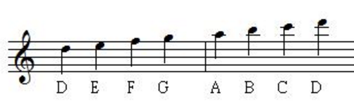

# JE Transcore [](https://badge.fury.io/js/je-transcore)

Tool for JE score transferring.


## What is JE score?

JE score is a form of expression of the music score, which is widely used in [Justice Eternal](https://tieba.baidu.com/f?ie=utf-8&kw=justice_eternal).

Usually, it only gives pitches in a music but doesn't contain the duration.

|Advantages|Disadvantages|
|---|---|
|Get started easily|Representability for Harmony|
|Readability for human|Not normalized|
|Edit and share in pure text|Hard to edit programmatically|

The mapping relation between JE score and note names:

|C |C# |D |D# |E |F |F# |G |G# |A |A# |B |
|---|---|---|---|---|---|---|---|---|---|---|---|
|1 |#1 |2 |#2 |3 |4 |#4 |5 |#5 |6 |#6 |7 |

An octave higher with `[]`

|C |C# |D |D# |E |F |F# |G |G# |A |A# |B |
|-----|---|---|---|---|---|---|---|---|---|---|---|
|[1] |[#1] |[2] |[#2] |[3] |[4] |[#4] |[5] |[#5] |[6] |[#6] |[7] |

An octave lower with `()`

|C |C# |D |D# |E |F |F# |G |G# |A |A# |B |
|-----|---|---|---|---|---|---|---|---|---|---|---|
|(1) |(#1) |(2) |(#2) |(3) |(4) |(#4) |(5) |(#5) |(6) |(#6) |(7) |


Because the JE score is used mostly by people who play the harmonica, for convenience, we have `#3 == 4` and `#7 == [1]`.




All of the following JE scores are valid

```
234567[1][2]  // or
23#3567[1][2]  // or
234567#7[2]  // or
23#3567#7[2] // or

// several notes can be nested in one pair of parentheses/brackets
234567[12]
```

Spaces and newlines may be added for readability or providing hints for the rhythm.

## Usage

```
npm install je-transcore
```

```js
import Transcore from 'je-transcore';

const input = `
#2#5#5 5#3#2#6#5
#1#2#35#5 #7#6#5

1#1#2 1#1#2 #35#5 1#55#3#2
#3#3#3#2#1(#7) (#6)(#6)(#7)#1#1#1(#7)(#6)
1#1#2 3#35 #35#5 1#55#55
#3#3#3#2#6#5 (#6)(#7)#1#2#3#25#5 [#2#55#5#6#5]
#5#1(#7)#1#5#5 #3#35#55#3#2
(#6)(#7) #1#1#2#1#2 #2#2#355#5#3 5#5#3
#35#5 #5#55#5#6 [#5#5#5#5#5#6#6]

#2#2#6 #6#5#6#7#7
#2#6#6#5#6#7#55#5
5#3#2#5 #1#2#3#5#7[#1]#6
#2#2#6 #6#5#6#7#7
#2#6 #6#5#6#7#1#7#5
#35#5#6#7 #1#5#5#6#7#6#5#5
#2#3 #35#5#5#6#7#6#5#5
`;

const result = Transcore.tune(input, { offset: -1 });
console.log(result);

`
255 #43265
123#45 765

(7)12 (7)12 3#45 (7)5#432
33321(7) (667)111(76)
(7)12 #23#4 3#45 (7)5#45#4
333265 (67)1232#45 [25#4565]
51(7)155 33#45#432
(67) 11212 223#4#453 #453
3#45 55#456 [5555566]

226 65677
2665675#45
#4325 12357[1]6
226 65677
26 6567175
3#4567 15567655
23 3#45567655
`;
```

### API

#### Transcore.tune(source, options)
##### source:
Source score

##### options:

```js
{
  offset: Number, Change tune by offset
  preferSharpE: Boolean, Output `#3` instead of `4`
  preferSharpB: Boolean, Output `#7` instead of `[1]`
}
```

##### Example
```js
const input = '(7)1#12#2345#56#67[1]';
const result = Transcore.tune(input, { preferSharpB: true, preferSharpE: true });
console.log(result);
// '(7#7)#12#23#35#56#67#7'
```

## License

MIT
