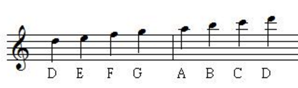

# Introduction

## What is the JE score?

JE score is a form of expression of the music score, which is widely used in [Justice Eternal](https://tieba.baidu.com/f?ie=utf-8&kw=justice_eternal).

Usually, it only gives pitches in a music but doesn't contain the duration.

|Advantages|Disadvantages|
|---|---|
|Get started easily|Representability for Harmony|
|Readability for human|Not normalized|
|Edit and share in pure text|Hard to edit programmatically|

The mapping relation between JE score and note names:

|C |C# |D |D# |E |F |F# |G |G# |A |A# |B |
|---|---|---|---|---|---|---|---|---|---|---|---|
|1 |#1 |2 |#2 |3 |4 |#4 |5 |#5 |6 |#6 |7 |

An octave higher with `[]`

|C |C# |D |D# |E |F |F# |G |G# |A |A# |B |
|-----|---|---|---|---|---|---|---|---|---|---|---|
|[1] |[#1] |[2] |[#2] |[3] |[4] |[#4] |[5] |[#5] |[6] |[#6] |[7] |

An octave lower with `()`

|C |C# |D |D# |E |F |F# |G |G# |A |A# |B |
|-----|---|---|---|---|---|---|---|---|---|---|---|
|(1) |(#1) |(2) |(#2) |(3) |(4) |(#4) |(5) |(#5) |(6) |(#6) |(7) |


Because the JE score is used mostly by people who play the harmonica, for convenience, we have `#3 == 4` and `#7 == [1]`.




All of the following JE scores are valid

```
234567[1][2]  // or
23#3567[1][2]  // or
234567#7[2]  // or
23#3567#7[2] // or

// several notes can be nested in one pair of parentheses/brackets
234567[12]
```

Spaces and newlines may be added for readability or providing hints for the rhythm.


## What is the BD score?
BD score is like the JE score but designed for chromatic harmonicas.

For example `B5(D6)`. `B5` means to blow at the 5th hole, `(D6)` means to press the button and draw at the 6th hole.

||1'|2'|3'|4'|1|2|3|4|5|6|7|8|9|10|11|12|
|--|--|--|--|--|--|--|--|--|--|--|--|--|--|--|--|--|
|**blow**|C|E|G|C|C|E|G|C|C|E|G|C|C|E|G|C|
|**draw**|D|F|A|B|D|F|A|B|D|F|A|B|D|F|A|B|

|pressed|1'|2'|3'|4'|1|2|3|4|5|6|7|8|9|10|11|12|
|--|--|--|--|--|--|--|--|--|--|--|--|--|--|--|--|--|
|**blow**|C#|F|G#|C#|C#|F|G#|C#|C#|F|G#|C#|C#|F|G#|C#|
|**draw**|D#|F#|A#|C|D#|F#|A#|C|D#|F#|A#|C|D#|F#|A#|*D*|

